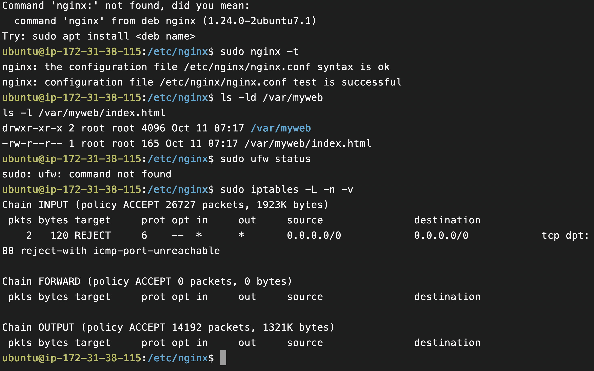

# Troubleshooting Lab - Web Server

## Ubuntu machine provided by teacher can't be connectd to the http nginx server

## 2024-11-07

## Root Cause

1. The `nginx_conf` file is not properly configured with unexpected `;`.

   

2. The `index.html` file is not authorized to be accessed by the server.

   

3. The http port is conflicting with another service.

   

4. The iptables is blocking the http port.

   

## Resolution and recovery

### Root Cause 1

1. `nginx -t` command is used to check the syntax of the `nginx_conf` file.
2. `nano /etc/nginx/nginx.conf`: open the file to remove the unexpected `;`.

   

### Root Cause 2

1. `ls -l /var/myweb`: check the permission of the file.
2. `sudo chmod 644 /var/myweb/index.html`: change the permission of the file.

   

### Root Cause 3

1. `sudo lsof -i :80`: check the service that is using the port.
2. Find the service srv that is using the port.
3. `sudo systemctl stop srv`: stop the service.
4. `sudo systemctl restart nginx`: start the nginx service.

   

### Root Cause 4

1. `sudo iptables -L -n -v`: check the iptables rules.
2. Find the INPUT rule reject enter the http port.
3. `sudo iptables -D INPUT 1`: delete the rule.

   

## Corrective and Preventative Measures

### When rebooting the machine, the nginx service should be started automatically, but it is not

#### Corrective

1. `sudo systemctl disable srv.service`: disable the service that prevent it automaticlly starting when rebooting.

   

2. `sudo cat /etc/ipables/rules.v4`: check the iptables rules and delete the rule that block the http port.

   

3. `sudo systemctl restart nginx`: start the nginx service.

   

# 心得

自己之前也有使用過 nginx 來做負載平衡，但是環境都是默認設定好的，也就是說這次遇到的問題都是第一次見到，透過這次上課的練習，讓我更加知道架設一個系統需要考慮的問題，包括檔案的 format、權限、port 的使用、iptables Rule 等等，我相信之後專案正式上線的時候，也多多少少會遇到相似的問題，希望這次除錯的經驗可以派上用場。
