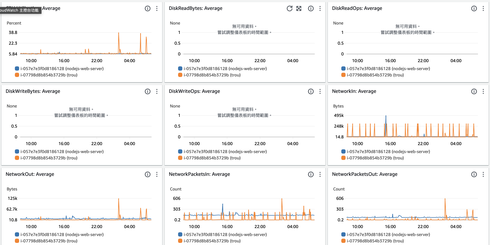
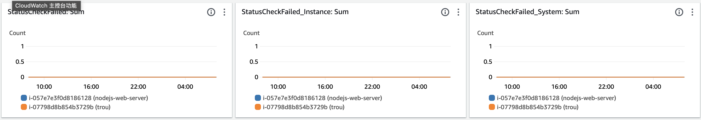
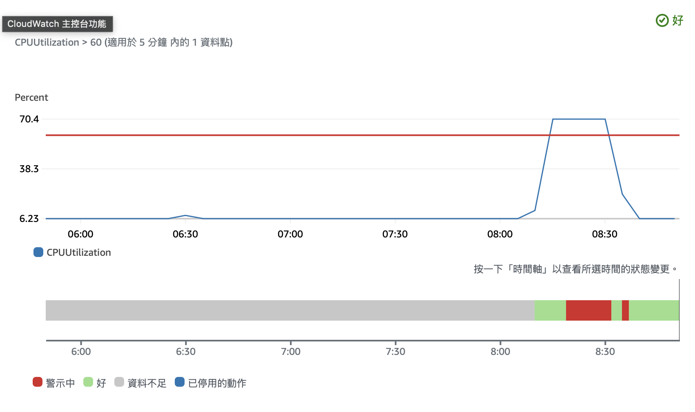
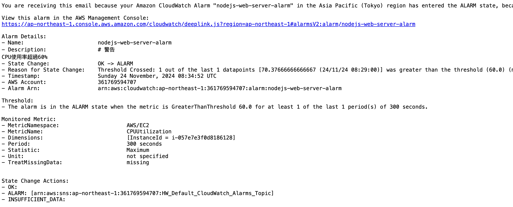
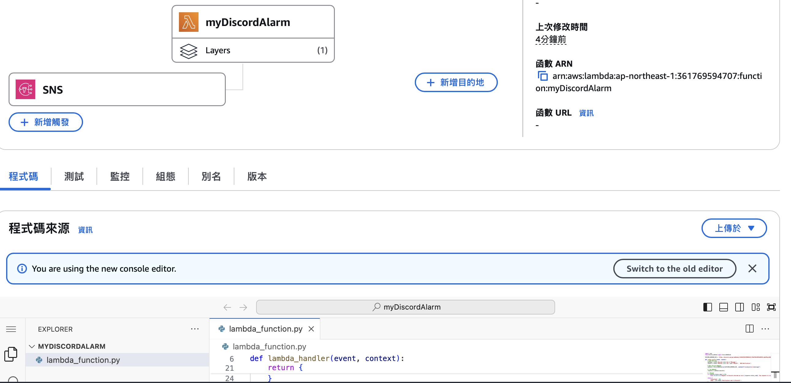
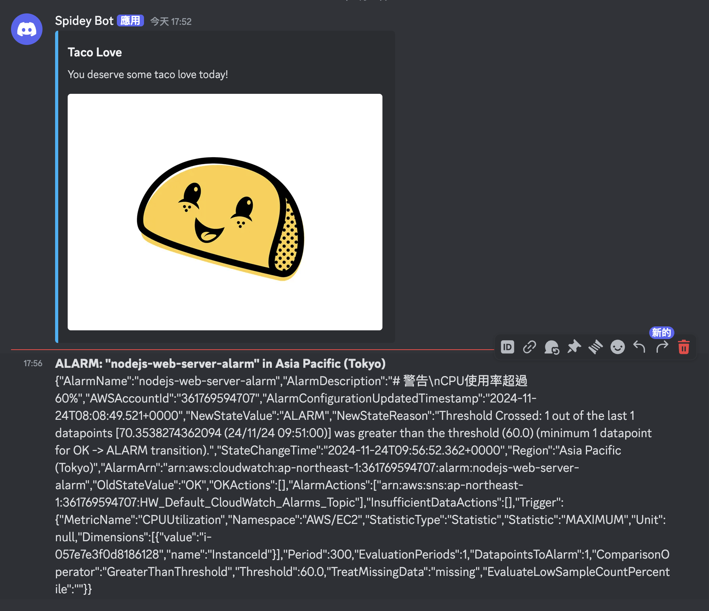
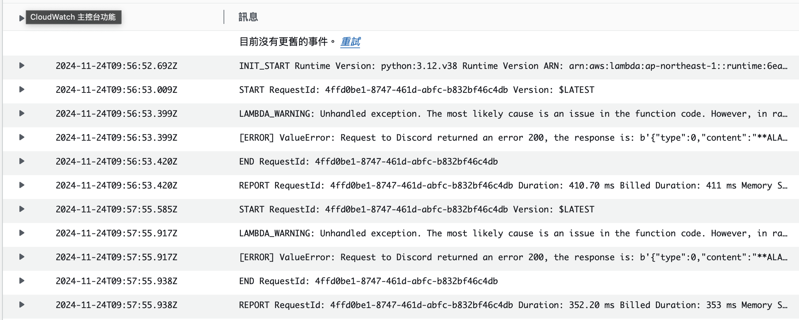

# Monitor & Notification Lab - README

## EC2 instance 的 metrics




## AWS CloudWatch Alarm



## SNS Topic to Email



# Send notification to Discord by Lambda

## Lambda Preparation

1. Build Layer

   - Create a folder named `python`
   - Run the following command to install the dependencies:
     ```
     pip3 install -t . discord-webhook
     ```
   - Compress the `python` folder to a zip file named `python.zip`
   - Upload the zip file to a new Lambda layer

2. Create Lambda Function
   - Create a new Lambda function
   - Add the layer created in step 1
   - Set the variable `WEBHOOK_URL` to the Discord webhook URL

## SNS Topic to Lambda



## Discord Notification



## LOG


